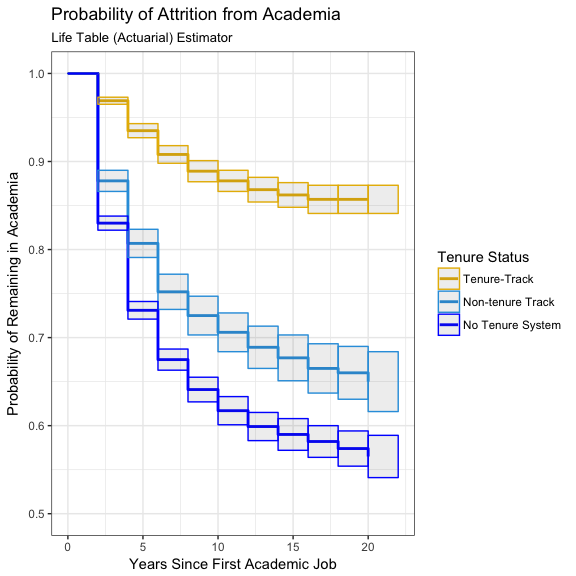
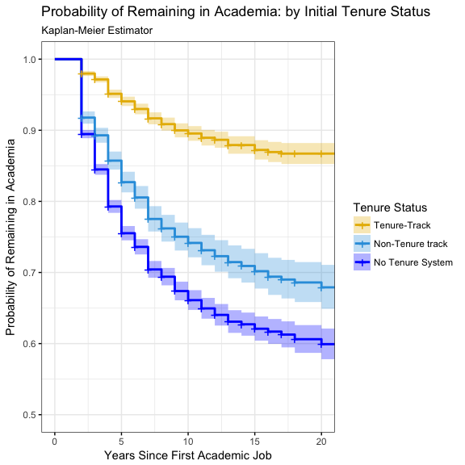

Faculty Attrition
================
Chad Evans

Built with R version 3.3.2.

Contents
--------

-   [Configure](#configure)
    -   directories
    -   libraries
    -   data
    -   helper functions
-   [Munge](#munge)
-   [Life Tables](#life-tables)
    -   Life table of all faculty, aggregated
    -   Life table of faculty, by Tenure Status
-   [Graphing Survival Curves of Faculty](#graphing-survival-curves-of-faculty)
    -   Life Table Estimator
    -   Kaplan-Meier Estimator
-   [Cox Proportional Hazards Model](#cox-proportional-hazards-model)
    -   [Right Censored Data Model](#right-censored-data-model)
    -   [Interval Censored Data Model](#interval-censored-data-model)
-   [Accelerated Failure Time Models](#accelerated-failure-time-models)
    -   Exponential
    -   Lognormal
    -   [AFT Specification](#aft-specification)
-   [Comparing the Exponential AFT Model and the Cox Models](#comparing-the-exponential-aft-model-and-the-cox-models)
-   [Final Model](#final-model)
-   [Conclusions](#conclusions)

Configure
---------

``` r
library(knitr)
library(tidyverse)
library(corrplot)
library(Hmisc)
library(plyr)
library(dplyr)
library(survival)
library(KMsurv)
library(car)
library(RColorBrewer)
library(survminer)
library(icenReg)
library(readxl)
```

Munge
-----

``` r
sdata$EntryDate<-as.numeric(sdata$EntryDate)
sdata$EndDate<-as.numeric(sdata$EndDate)
sdata$lower<-sdata$EndDate-sdata$EntryDate
sdata$upper<-sdata$ExitDate-sdata$EntryDate
sdata$upper[sdata$Censor==0]<-NA
sdata$TIME2<-sdata$EndDate-sdata$EntryDate+1 # we add onen here for the same reason (but time is different calc.)

data<-sdata %>%
  filter(!(EntryTENSTA=="Tenured")) %>% # Remove those few who start off with tenure
  droplevels()
data$TIME<-data$ExitDate-data$EntryDate
data$INTERVAL = floor(data$TIME/2)
  
data$DEG2ENTRY<-as.numeric(data$EntryDate)-data$DGRYR
data$EntryEMTP<-relevel(data$EntryEMTP,ref = "Four-year")
data$EntryWAPRI<-relevel(data$EntryWAPRI,ref = "Teaching")
data$GENDER<-relevel(data$GENDER,ref = "Male")
data$EntryEMTP[data$EntryEMTP=="Other Ed"]<-'Two-year'
data$EntryEMTP<-droplevels(data$EntryEMTP)
vars<-data.frame(model.matrix( ~ EntryTENSTA - 1, data=data )) # Need dummy coded for coxph tt()
data$NTT<-vars$EntryTENSTANTT
data$NTS<-vars$EntryTENSTANon.tenure.System.Position
```

``` r
length(unique(data$REFID))  # The number of individuals who participated in the study
```

Life Tables
-----------

The life table method or estimator is also known as the actuarial method/estimator. For the life table method, if observations are censored on the same month (or time unit) that events occurred, they are assumed to be at risk for just half the month. This is in contrast to the Kaplan-Meier estimator which assumes they are at risk for the whole month. The KM estimator is generally better for smaller datasets with exact times of event occurance.

First let's write a function that takes the data as its argument and generates a lifetable.

``` r
intervals <- 2  # number units per intervals for life table
LifeTableIt <- function(data) {
    ltab.data <- data %>% mutate(interval = floor(TIME/intervals)) %>% select(interval, 
        Censor) %>% group_by(interval) %>% dplyr::summarise(attrit = sum(Censor), 
        count = n()) %>% mutate(nlost = count - attrit)
    int <- c(ltab.data$interval, NA)  #length is 1 + nlost and nevent 
    lifetable <- round(with(ltab.data, lifetab(tis = int, ninit = nrow(data), 
        nlost = nlost, nevent = attrit)), 3)
    return(lifetable)
}
```

### Life Table of All Faculty, Aggregated

The first Life Table will tabulate the survival probabilities and hazards for all faculty (aggregated).

``` r
ltab <- LifeTableIt(data)
kable(ltab)
```

|       |  nsubs|  nlost|    nrisk|  nevent|   surv|    pdf|  hazard|  se.surv|  se.pdf|  se.hazard|
|-------|------:|------:|--------:|-------:|------:|------:|-------:|--------:|-------:|----------:|
| 1-2   |  21436|   8051|  17410.5|    2025|  1.000|  0.116|   0.123|    0.000|   0.002|      0.003|
| 2-3   |  11360|   3550|   9585.0|     770|  0.884|  0.071|   0.084|    0.002|   0.002|      0.003|
| 3-4   |   7040|   2067|   6006.5|     329|  0.813|  0.045|   0.056|    0.003|   0.002|      0.003|
| 4-5   |   4644|   1304|   3992.0|     139|  0.768|  0.027|   0.035|    0.004|   0.002|      0.003|
| 5-6   |   3201|    365|   3018.5|      72|  0.741|  0.018|   0.024|    0.004|   0.002|      0.003|
| 6-7   |   2764|    742|   2393.0|      48|  0.724|  0.015|   0.020|    0.005|   0.002|      0.003|
| 7-8   |   1974|    630|   1659.0|      20|  0.709|  0.009|   0.012|    0.005|   0.002|      0.003|
| 8-9   |   1324|    470|   1089.0|      12|  0.701|  0.008|   0.011|    0.005|   0.002|      0.003|
| 9-10  |    842|    314|    685.0|       4|  0.693|  0.004|   0.006|    0.006|   0.002|      0.003|
| 10-11 |    524|    269|    389.5|       3|  0.689|  0.005|   0.008|    0.006|   0.003|      0.004|
| 11-NA |    252|    252|    126.0|       0|  0.684|     NA|      NA|    0.007|      NA|         NA|

By the last interval, over 30 percent of faculty have attrited from their careers in academia. The hazard is highest during the early stages of the careers and then plateaus later on.

### Life Table for Faculty, by Tenure Status

Now, let's tabulate lifetables for each of the tenure status groups and extract survival probabilities.

``` r
LT_TT <- data %>% filter(EntryTENSTA == "Tenure-Track") %>% LifeTableIt()

LT_NTT <- data %>% filter(EntryTENSTA == "NTT") %>% LifeTableIt()

LT_NTS <- data %>% filter(EntryTENSTA == "Non-tenure System/Position") %>% LifeTableIt()

LTs <- data.frame(LT_TT[, c("surv", "se.surv")], LT_NTT[, c("surv", "se.surv")], 
    LT_NTS[, c("surv", "se.surv")])
names(LTs) <- c("TT Surv", "TT SE", "NTT Surv", "NTT SE", "NTS Surv", "NTS SE")
LTs
```

    ##       TT Surv TT SE NTT Surv NTT SE NTS Surv NTS SE
    ## 1-2     1.000 0.000    1.000  0.000    1.000  0.000
    ## 2-3     0.969 0.002    0.878  0.006    0.830  0.004
    ## 3-4     0.935 0.004    0.807  0.008    0.731  0.005
    ## 4-5     0.908 0.005    0.752  0.010    0.675  0.006
    ## 5-6     0.889 0.006    0.725  0.011    0.641  0.007
    ## 6-7     0.878 0.006    0.706  0.011    0.617  0.008
    ## 7-8     0.868 0.007    0.689  0.012    0.599  0.008
    ## 8-9     0.862 0.007    0.677  0.013    0.590  0.009
    ## 9-10    0.857 0.008    0.665  0.014    0.582  0.009
    ## 10-11   0.857 0.008    0.660  0.015    0.574  0.010
    ## 11-NA   0.857 0.008    0.650  0.017    0.565  0.012

Clearly, the survival probabilities cascade much more rapidly for NTT and NTS faculty.

### Graphing Survival Curves of Faculty

#### Life Table (Actuarial) Estimator

Survival probabilities are sometimes communicated most efficiently in graphical form. The following graph plots the actuarial survival probabilities for each class of faculty.

``` r
TYPE <- c(rep("Tenure-Track", 11), rep("Non-Tenure Track", 11), rep("Non-Tenure System", 
    11))
SURV <- c(LTs$`TT Surv`, LTs$`NTT Surv`, LTs$`NTS Surv`)
SE <- c(LTs$`TT SE`, LTs$`NTT SE`, LTs$`NTS SE`)
INTERVAL <- rep(c(0:10), 3)
TIME <- rep(2 * c(0:10), 3)
ymin <- SURV - 2 * SE
ymax <- SURV + 2 * SE
ltab2 <- data.frame(TYPE, SURV, TIME, ymin, ymax)

ggplot(ltab2, aes(x = TIME, y = SURV, group = rev(TYPE), colour = rev(TYPE))) + 
    ylim(0.5, 1) + geom_step(size = 1) + labs(title = "Probability of Attrition from Academia", 
    subtitle = "Life Table (Actuarial) Estimator", x = "Years Since First Academic Job", 
    y = "Probability of Remaining in Academia") + scale_colour_manual(name = "Tenure Status", 
    labels = c("Tenure-Track", "Non-tenure Track", "No Tenure System"), values = c("#E7B800", 
        "#2E9FDF", "blue")) + theme_bw() + geom_rect(aes(xmin = TIME, xmax = TIME + 
    2, ymin = ymin, ymax = ymax), alpha = 0.1)
```



#### Kaplan-Meier (Product Limit) Estimator

These survival probabilities can also be estimated and graphed using the KM estimator. Allison recommends reporting only the actuarial estimator, probably because it is more robust for larger samples.

``` r
km.tenure <- survfit(Surv(TIME, Censor) ~ strata(EntryTENSTA), data = data, 
    type = "kaplan-meier")
ggsurvplot(km.tenure, data = data, ylim = c(0.5, 1), size = 1, palette = c("#E7B800", 
    "#2E9FDF", "blue"), conf.int = TRUE, legend.labs = c("Tenure-Track", "Non-Tenure track", 
    "No Tenure System"), ggtheme = theme_bw(), ncensor.plot.height = 0.25, title = "Probability of Remaining in Academia: by Initial Tenure Status", 
    subtitle = "Kaplan-Meier Estimator", xlab = "Years Since First Academic Job", 
    ylab = "Probability of Remaining in Academia", legend = "right", legend.title = "Tenure Status", 
    ncensor.plot = F)
```



The default confidence interval (above) is log, which calculates intervals based on log(survival). Other options include plain or log-log. IDRE has code for another method called loghall.

### Statistical Test for differences

Often it is useful to have a statistical test for whether survival curves of two groups differ. The following function implements the G-rho family of Harrington and Fleming (1982), with weights on each death of S(t)^rho, where S is the Kaplan-Meier estimate of survival. With rho = 0 this is the log-rank or Mantel-Haenszel test, and with rho = 1 it is equivalent to the Peto & Peto modification of the Gehan-Wilcoxon test. Allison also discusses other possibilities, including the Wilcoxon test, the Cox test of equality, the Tarone-Ware test of equality, the Peto-Peto-Prentice test of equality and the Generalized Fleming-Harrington test of equality. Let's look at the most common test, the log-rank test.

``` r
survdiff(Surv(TIME, Censor) ~ EntryTENSTA, data = data, rho = 0)  # log-rank or Mantel-Haenszel test
```

    ## Call:
    ## survdiff(formula = Surv(TIME, Censor) ~ EntryTENSTA, data = data, 
    ##     rho = 0)
    ## 
    ##                                            N Observed Expected (O-E)^2/E
    ## EntryTENSTA=Tenure-Track                6667      453     1226    487.70
    ## EntryTENSTA=NTT                         3942      653      609      3.12
    ## EntryTENSTA=Non-tenure System/Position 10827     2316     1586    335.74
    ##                                        (O-E)^2/V
    ## EntryTENSTA=Tenure-Track                     808
    ## EntryTENSTA=NTT                                4
    ## EntryTENSTA=Non-tenure System/Position       665
    ## 
    ##  Chisq= 880  on 2 degrees of freedom, p= 0

The null hypothesis for a log-rank test is that the groups have the same survival. In this case, the Chi-square statistic is significant for tenure status of first appointment. The survival curve, therefore, differs based on the tenure status of the PhD recipient's first academic job. But the KM approach is not able to estimate survival adjusted for covariates. For this reason, we will return to the semi-parametric Cox Proportional hazards model and also parametric survival models shortly.

#### Summary of Nonparametric models

Life tables are a great way to summarize distributions and survival curves. Kaplan-Meier curves and log-rank tests are also useful, however, they are most useful when the predictor variable is categorical (e.g., drug vs. placebo), or takes a small number of values (e.g., drug doses 0, 20, 50, and 100 mg/day) that can be treated as categorical. The log-rank test and KM curves don’t work easily with quantitative predictors. For quantitative predictor variables, we turn to alternative methods like the Cox proportional hazards model or Accelerated Failure Time (AFT) models. Such models work also with categorical predictor variables, encoded as {0,1} indicator or dummy variables.

Substantially, the actuarial estimator and KM estimator tell similar stories. Attrition is much higher and more rapid for faculty working off the tenure track. The lifetable estimator perhaps shows a slightly higher attrition rate for NTS faculty, comparted to the KM estimate.

Regression Models for Survival Data
-----------------------------------

There are two types of regression models in survival analysis:

1.  Semi-parametric models, the most common of which is the Cox Proportional Hazards model. Proportional hazard models in general (like the Cox model) assume that the effect of a covariate is to multiply a baseline hazard by some constant. Hazards are “proportional” when the ratio of the hazards for any two individuals is constant, i.e., it does not depend on time.

2.  Fully Parametric AFT models, where it is assumed that log(To) has a specific probability distribution. This class of models assumes that the effect of a covariate is to accelerate or decelerate the life course of a career by some constant.

One case worth noting is that the Weibull distribution (including the exponential distribution as a special case) can be parameterised as either a proportional hazards model or an AFT model. It is the only family of distributions that possesses this property.

### Cox Proportional Hazards Model

The most common semiparametric method is the Cox Proportional Hazards Model. The biggest advantage of the Cox model relates to the flexibilty it offers with regard to functional form. Unlike parametric approaches, you do not need to actually specify the functional form of the baseline hazard function. We only parameterize the effects of covariates. Because no distributional assumptions are made about survival times, our model is more robust to errors in specification.

Cox models work mathematically because, when hazards are proportional, it is possible to factor the Likelihood function into a part with betas and a part with betas and the baseline hazard function. We sacrifice the information of part two and use the standard likelihood approach to estimate the betas in part one (which is consistent and asymptotically normal). This approach is not fully efficient, but we gain flexibilty with functional form when we do this (making estimates more robust). It turns out that estimating part one only requires knowing the order in which events took place.

Mathematically, the (partial) likelihood function is expressed as follows: $PL = \\prod\_{k=1}^{K}L\_k = \\prod\_{k=1}^{K}\\dfrac{h\_k(t\_k)}{\\sum\_{j \\in R(t\_k)}h\_j(t\_k)}$

To clarify, K is the total number of events experienced in the sample. R(t\_k) is the risk set (i.e., all the individuals who remain at risk of event occurance, tj ≥ tk). As in traditional maximum likelihood, we iteratively choose the set of parameters that maximize PL (the partial likelihood value associated with the observed values).

Consider a set of 10 individuals. Assume 7 of them experience events and 3 do not. First we order the set by the time of event occurance or censoring. This establishes the rank order of event times. Then we calculate the partial likelihood with respect to each person who experiences an event. The first likelihood would be $\\dfrac{e^{\\beta X\_1}}{e^{\\beta X\_2}+e^{\\beta X\_3}+...+e^{\\beta X\_10}}$.

The second rank ordered person's likelihood would be $\\dfrac{e^{\\beta X\_2}}{e^{\\beta X\_3}+e^{\\beta X\_4}+...+e^{\\beta X\_10}}$.

Censored observations would not contribute a likelhood because they did not experience an event. Censoring is accomodated, however, in that they influence the denominator in the likelihoods of individuals who did experience an event. Again, it is important to point out that, because of the factorization, the partial likelihood does not depend on the specific time at which events occurred. It only depends on the order of event occurance.

There are some implicit assumptions, however. For one, we must assume that all characteristics impacting the hazard are included in the model. Also, censoring must be noninformative, observations must be independent and variable must also be measured without error.

Survival analysis is more robust than traditional OLS, in particular because of how it accommodates censoring. Quite commonly, survival data are right censored. This means that for some observations, we do not observe the event of interest. We only know that the event occurs sometime in the future for that observation. In other cases, data are interval censored. This means that we do not directly observe the event times of individuals, we can only say that the event occurs within some specified interval. Of course, sometimes data are both right censored (for some observations) and interval censored. This in the case for this study. We observe several waves of data and we know the interval during which the event occured for most observations. Sometimes we only know that the event occurs some point after the last interval.

Unfortunately, R's capabilities are somewhat limited with regard to interval censored data. coxph() in the "survival" package (the function most commonly used for cox models) does not account for interval censoring--it only handles right censoring. Nevertheless, in this exercise we'll first specify a cox model treating time-to-event as if it were entirely right censored. After that, we'll turn to another package that is less commonly used in survival analysis, but does handle both right censoring and interval censored data.

For specifying our model, we will subset the data and first train a model using training data. After we are satisfied with that specification, we'll test using the independent test data. This will help prevent overfitting.

``` r
smp_size <- floor(0.6 * nrow(data))
set.seed(777)
train_ind <- sample(seq_len(nrow(data)), size = smp_size)

train <- data[train_ind, ]
test <- data[-train_ind, ]
```

#### Right Censored Data Model

First, we fit a simple Cox model predicting attrition from academia from a categorical predictor of tenure status at workforce entry. We assume here that we know exact event times (not the interval). We employ the efron method of dealing with ties, although other popular methods (e.g., breslow method) are available. The Efron approximation is more accurate when dealing with tied death times, and is as efficient computationally.

These data are also censored (partially) on the left. Specifically, we know that individuals entered academia between two study waves, but we do not know the particular entry year. So we make an assumption for all of our models that time of entry was one year prior to the first wave when we observe their participation in academia. In other words, we assume that they entered the position midway through the previous interval. This will be about right on average.

The Surv function here frames censoring as follows. It assumes that individuals entered the study halfway through the previous interval. It treats censoring from the "EndDate"--that is, the last year he or she was still employed. Censoring, of course, happens after that point, so an individual who enters in year 0, remains in the study through year 2 in its entirely and subsequently drops out between year 2 and 4 would be coded as "3+." There are two years for the full interval, plus the extra entry year.

``` r
RC_Mod1 <- coxph(Surv(TIME2, Censor) ~ NTT + NTS, data = test, method = "efron")  # breslow option available
summary(RC_Mod1)
```

Proportional Hazards models and AFT models must be interpreted in different ways. AFT models give the percentage change in survival time. Cox PH models give the percentage change to the hazard at all time points, following this formula: *h*(*t*)=*h*<sub>0</sub>(*t*)*e*<sup>(*β*′*x*)</sup>

In this case, the effect of initial tenure status on time to attrition has an estimated coefficient of 1.0089259 and 1.3237404. Exponentiated, this means that subjects appointed to lower tenure-status jobs multiply their baseline hazards *h*<sub>0</sub>(*t*) by a factor of 2.7426537 and 3.7574493. Their "risk"" of attriting from academia is 174.2653671 and 275.744933 percent higher than academics who begin immediately on the tenure-track. Importantly, Cox models state that this is the impact on the subject's hazard at any given time, t. It does not, however, imply an expansion (or contraction) of the lifespan of the subject.

Now let's build a more comprehensive model. Let's specify a complex model using training data and then test that model using independent test data. This will prevent overfitting. Importantly we'll include an interaction between time and our tenure status variables (NTT or NTS dummies) to test the assumption of proportional hazards. Here we use the TIME2 variable which simple adds an extra year to everyone's event time. You are basically assuming then that their interval began halfway through the previous interval.

``` r
RC_Mod2 <- coxph(Surv(TIME2, Censor) ~ NTT + NTS + DEG2ENTRY + EntryWAPRI + 
    EntryWKTRNI + EntryPUBPRI + EntryEMTP + EntryPUBPRI * EntryEMTP + SDRCARN + 
    EntryAGE + GENDER + MINRTY + EntryMARIND + EntryCHLVIN + EntryCTZUSIN + 
    tt(NTT) + tt(NTS), data = test, method = "efron", robust = TRUE, tt = function(x, 
    t, ...) x * log(t))
summary(RC_Mod2)
```

Even after controlling for background characteristics, there are significant differences. Here, NTT status or working at a college or university without a tenure system impacts the hazard, multiplying the baseline by a factor of 2.8598117 and 3.4658201. This is equivalent to saying that each tenure status increases the hazard of attrition by 185.9811676 and 246.5820096 percent, controlling for background characteristics. R output also provides the exponentiated negative coefficient. To my understanding, that just allows you to compare the groups relative to the baseline hazard of the tenure-track group. Robust standard errors were used in this model.

The model reveals other important predcitors, including the subject's main job and possible interactions between institution type and public/private status. The interaction between time and no tenure system status is somewhat concerning. These issues are being worked through with Allison.

An important assumption of the Cox model is that hazard functions are proportional. We can test each of the variables in the model, as well as test the model as a whole using the cox.zph() function. It tests proportionality by interacting each predictor with log time (km transformation). Rho is the pearson product-moment correlation between the scaled residuals (Schoenfeld) and log(time) for each covariate. The global test jointly tests all of the interactions. Low p-values suggest a violation of the assumption of proportional hazards.

``` r
cox.zph <- cox.zph(RC_Mod2, transform = "km")
round(cox.zph$table, 3)
```

    ##                                                       rho    chisq     p
    ## NTT                                                -0.519  438.477 0.000
    ## NTS                                                -0.595  634.254 0.000
    ## DEG2ENTRY                                           0.012    0.196 0.658
    ## EntryWAPRIOther                                    -0.016    0.303 0.582
    ## EntryWAPRIResearch                                 -0.032    1.188 0.276
    ## EntryWKTRNITraining                                 0.016    0.335 0.563
    ## EntryPUBPRIPrivate                                 -0.051    3.397 0.065
    ## EntryEMTPTwo-year                                   0.014    0.237 0.627
    ## EntryEMTPMed                                        0.104   13.156 0.000
    ## EntryEMTPUni Research Institute                     0.002    0.003 0.956
    ## SDRCARNR2                                           0.006    0.049 0.824
    ## SDRCARNDoctorate                                   -0.001    0.001 0.970
    ## SDRCARNOther                                        0.030    1.198 0.274
    ## SDRCARNMedHealth                                    0.111   15.238 0.000
    ## EntryAGE                                            0.063    4.779 0.029
    ## GENDERFemale                                        0.056    3.918 0.048
    ## MINRTYYes                                          -0.052    3.420 0.064
    ## EntryMARINDYes                                     -0.052    3.480 0.062
    ## EntryCHLVINYes                                      0.000    0.000 0.988
    ## EntryCTZUSINCitizen                                 0.028    0.961 0.327
    ## tt(NTT)                                             0.606  658.787 0.000
    ## tt(NTS)                                             0.698 1117.724 0.000
    ## EntryPUBPRIPrivate:EntryEMTPTwo-year                0.025    0.814 0.367
    ## EntryPUBPRIPrivate:EntryEMTPMed                     0.030    1.116 0.291
    ## EntryPUBPRIPrivate:EntryEMTPUni Research Institute -0.002    0.003 0.954
    ## GLOBAL                                                 NA 1212.760 0.000

Generally, there is some evidence that the hazards are not propoprtional (violating the key assumption). For most covariates, rho is not significant. However, it is concerning that it is significant for our two most important predictors above (NTT and Non-tenure system). Also, the global test is significant. The significant interaction of time and no tenure system status also suggests that hazards may not be proportional across strata.

#### Interval Censored Data Model

The data used in this study not only have right censoring, they are interval censored. We know the interval during when an event took place, but we do not know the particular time of the event. Unfortunately, the well-developed and supported function coxph() from the survival package does not handle interval censoring. I searched for a different R package capable of handling interval censoring and found the icenreg package. There is some documentation for this package, however, it is considerably less developed than function in the suvival package.

We'll follow the same model development approach as in the last specification. We'll try to develop a complex model using training data and then apply this model to test data.

Using thsi method does not require the assumption that the subject enters the study midway through the previous wave. It only depends on the interval itself. I suspect this is related to the fact that Cox models do not require the time of occurance, only the order in which events took place.

``` r
IC_Mod1 <- ic_sp(Surv(lower, upper, type = "interval2") ~ NTT + NTS, model = "ph", 
    bs_samples = 100, data = data)
summary(IC_Mod1)
```

``` r
IC_Mod2 <- ic_sp(Surv(lower, upper, type = "interval2") ~ NTT + NTS + DEG2ENTRY + 
    EntryWAPRI + EntryWKTRNI + EntryPUBPRI + EntryEMTP + EntryPUBPRI * EntryEMTP + 
    SDRCARN + EntryAGE + GENDER + MINRTY + EntryMARIND + EntryCHLVIN + EntryCTZUSIN, 
    model = "ph", bs_samples = 100, data = test)
summary(IC_Mod2)
```

``` r
# This is time-intensive at bs_samples=10, maybe a minute per sample.
IC_Mod3 <- ic_sp(Surv(lower, upper, type = "interval2") ~ NTT + NTS + DEG2ENTRY + 
    EntryWAPRI + EntryWKTRNI + EntryPUBPRI + EntryEMTP + EntryPUBPRI * EntryEMTP + 
    EntryPUBPRI * EntryEMTP + SDRCARN + EntryAGE + GENDER + MINRTY + EntryMARIND + 
    EntryCHLVIN + EntryCTZUSIN + TIME * NTT + TIME * NTS, model = "ph", bs_samples = 10, 
    data = data)
summary(IC_Mod3)
# Also, this model is wrong because there should not be a coefficient
# produced for time.  Furthermore, that coefficient sops up all the
# variation in event times
```

#### Summary of Cox Proportional Hazard Models

If the proportional hazards assumption holds, then it is possible to estimate the effect of parameter(s) without any consideration of the baseline hazard function. As mentioned, this is in contrast to parametric models--the focus of our next section. Even when proportional hazards are not truly proportional, we can include an interaction between the variable and time to correct for it.

### Accelerated Failure Time Models

Next, we fit a parametric survival regression model. These are location-scale models for an arbitrary transform of the time variable; the most common cases use a log transformation, leading to accelerated failure time (AFT) models. First, we assume the outcome has an exponential distribution--a good baseline distribution to start with (simplifies calculations). The exponential distribution implies a constant hazard rate. I also model with the log-logistic transformation. This is one of the more popular transformations because, unlike the Weibull distribution, it can exhibit a non-monotonic hazard function which increases at early times and decreases at later times. It also has a closed form solution that speeds up computation (important because of the consequences of censoring). The advantage of the Weibull (and by extention the exponential), of course, is that it can be parameterised as a PH model or an AFT model. In other words, the Weibull family can be interpreted as affecting the risk of event occurance or the duration of the lifespan. Other potential functions include log normal, gamma and inverse gaussian functions.

For fully parameterized models, the timing of an event matters (unlike the cox models that only require the order). So here we must also make an assumption that subject begin their academic work midway through the previous interval. So we add unity to the upper and lower interval bounds to adjust for this.

``` r
exp.mod <- survreg(Surv(lower + 1, upper + 1, type = "interval2") ~ EntryTENSTA + 
    EntryAGE, data = data, dist = "exponential")
```

For this first model, we parameterized log(t) using the exponential distribution. In the case of the exponential distribution, there is one extra parameter that allows *ϵ* to take on one of the extreme value distributions:

*f*(*ϵ*)=*e*<sup>(*ϵ* − *e*<sup>*ϵ*</sup>)</sup>

In the case of AFT models, covariates are interpreted as having a multiplicative effect on the survival time (the expected life span) of an individual. So, NTT status has a slope of -1.1321606 in the simple model above. This means that beginning in a non-tenure track position causes time to attrition to change by -67.7663932 percent. The expected time spent in academia before leaving, in other words, is lower for those starting in non-tenure track. Faculty beginning in no-tenure systems tend to spend even less time in academia -77.7773762 percent, compared to their tenure-track peers. In both cases, the life course is "accelerated."

We can also examine the coefficient for job-entry age. For a one unit increase in age, we expect a 0.7704377 percent change in survival time. Because the coefficient is so small, you can actually just multiply the coefficient by 100 to find an approximation of the percentage change. An increase in age "decelerates" the life course, thereby increasing the total expected time span spent in academia.

Because the exponential distribution is a special case of the Weibull family, we can interpret the coefficients as changes in the hazard (as we did for cox models). While this is a good baseline, the log logistic transformation is sometimes more commonly used, thanks to its computational efficiently and (relative) flexibility of functional form. For the log-logistic parameterization, the errors are scaled as follows:

Now let's estimate a log logistic model. We'll use the same specification, but allow epsilon to take on a slightly different density:
*f*(*ϵ*)=*e*<sup>*ϵ*</sup>/(1 + *e*<sup>*ϵ*</sup>)<sup>2</sup>

``` r
ll.mod <- survreg(Surv(lower + 1, upper + 1, type = "interval2") ~ EntryTENSTA + 
    EntryAGE, data = data, dist = "loglogistic")
```

In this case, the log logistic performs similarly to the exponential distribution, both in terms of fit and coefficient estimates. The simple curvature of the survival curves in this study makes both of these distributions similar. I'll opt for the exponential because it fits well, it is simpler and it can be interpreted in the same paradigm as before. We'll also fit the full model with robust standard errors.

#### Mathematics

1.  Construct the likelihood function
    -   uncensored cases contribute their density probability at t
    -   censored cases contribute their survival probability at t

2.  Simplify the expression
3.  Take the log to simplify the math
4.  Calculate the derivative and set it equal to zero
5.  Solve using, typically, the Newton-Raphson algorithm

``` r
AFT_mod <- survreg(Surv(lower + 1, upper + 1, type = "interval2") ~ NTT + NTS + 
    DEG2ENTRY + EntryWAPRI + EntryWKTRNI + EntryPUBPRI + EntryEMTP + EntryPUBPRI * 
    EntryEMTP + SDRCARN + EntryAGE + GENDER + MINRTY + EntryMARIND + EntryCHLVIN + 
    EntryCTZUSIN, data = test, dist = "exponential", robust = TRUE)
```

### AFT Specification

``` r
table <- as.data.frame(summary(AFT_mod)$table)
rownames(table) <- c("Intercept", "Non-tenure Track", "No Tenure System", "Time between Degree and Job", 
    "Administration/Other", "Research", "Workplace Training", "Private Control", 
    "Two-year", "Medical", "Research Institute", "PhD Research II", "PhD Doctorate Institution", 
    "PhD Other", "PhD Medical/Health", "Age", "Female", "Minority", "Married", 
    "Parent", "Citizen", "Private x Two-Year", "Private x Medical", "Private x Research Institute")
table$expCoef <- exp(table$Value)
names(table)[names(table) == "Std. Err"] <- "Robust SE"
aft_table <- round(table[, c("Value", "expCoef", "Robust SE", "z", "p")], 3)
kable(aft_table)
```

|                              |   Value|  expCoef|  Robust SE|        z|      p|
|------------------------------|-------:|--------:|----------:|--------:|------:|
| Intercept                    |   4.319|   75.129|      0.211|   20.478|  0.000|
| Non-tenure Track             |  -0.937|    0.392|      0.102|   -9.154|  0.000|
| No Tenure System             |  -1.086|    0.338|      0.091|  -11.942|  0.000|
| Time between Degree and Job  |  -0.001|    0.999|      0.017|   -0.032|  0.975|
| Administration/Other         |  -0.471|    0.624|      0.105|   -4.471|  0.000|
| Research                     |  -0.390|    0.677|      0.090|   -4.333|  0.000|
| Workplace Training           |  -0.027|    0.974|      0.061|   -0.440|  0.660|
| Private Control              |   0.060|    1.062|      0.090|    0.664|  0.506|
| Two-year                     |   0.214|    1.239|      0.239|    0.897|  0.370|
| Medical                      |  -0.170|    0.844|      0.098|   -1.726|  0.084|
| Research Institute           |  -0.066|    0.936|      0.110|   -0.603|  0.546|
| PhD Research II              |  -0.159|    0.853|      0.099|   -1.615|  0.106|
| PhD Doctorate Institution    |  -0.114|    0.892|      0.102|   -1.127|  0.260|
| PhD Other                    |  -0.257|    0.774|      0.211|   -1.214|  0.225|
| PhD Medical/Health           |  -0.105|    0.901|      0.138|   -0.755|  0.450|
| Age                          |   0.005|    1.005|      0.005|    0.976|  0.329|
| Female                       |   0.035|    1.036|      0.061|    0.572|  0.567|
| Minority                     |  -0.020|    0.980|      0.079|   -0.252|  0.801|
| Married                      |   0.100|    1.106|      0.072|    1.394|  0.163|
| Parent                       |   0.017|    1.017|      0.073|    0.226|  0.821|
| Citizen                      |   0.065|    1.068|      0.070|    0.937|  0.349|
| Private x Two-Year           |  -1.349|    0.259|      0.424|   -3.185|  0.001|
| Private x Medical            |  -0.164|    0.848|      0.140|   -1.174|  0.240|
| Private x Research Institute |  -0.291|    0.748|      0.178|   -1.635|  0.102|

The exponential distribution has a constant hazard *λ*(*t*)=*λ* and thus a survival function of *S*(*t*)=*e*<sup>−*λ*(*t*)</sup> and density of *f*(*t*)=*λ* × *e*<sup>−*λ*(*t*)</sup>. An interesting occurance is that the expected survival time for this distribution is *E*(*t*)=1/*λ* and its variance is *E*(*t*)=1/*λ*<sup>2</sup>. This makes the mean survival time equal to e^intercept (75.1287755). It's inverse (0.0133105) is the MLE of the (constant) hazard rate. Of course, the model performs poorly extrapolating to such an extreme timepoint.

AFT models are typcally interpreted in a way that covariates have a multiplicative effect on the expected survival time. So, with regard to tenure status, taking your first job as NTT accelerates the time to attrition by a factor of 0.3919478 (0.3919478 times shorter survival time compared to the baseline survival). Beginning an academic career in a non-tenure system accelerates the time to attrition by a factor of 0.3377075. The life course for these states is -60.8052173 and -66.229245 percent shorter, respectively.

The Weibull family of distributions (of which the exponential is a sub-class) has the advantage that covariates can also be interpreted as an impact on the hazard ratios. For this famiily of distributions, the coefficient is multiplied by -1 and then multiplied by a shape parameter (1/scale parameter). In the case of the exponential distributuion, the shape parameter is simply 1/1. So in our case, the hazard ratio comparing NTT to tenure-track positions is 2.55136. The risk of attrition increases by a factor of 2.55136 when one begins an academic career in a NTT position. Faculty with a first job at a non-teure system institution increases their risk by a factor of 2.961142.

Comparing the Exponential AFT Model and the Cox Models
------------------------------------------------------

``` r
space <- c("", "")
aft_table2 <- rbind(aft_table[1:21, c(1, 5)], space, space, aft_table[22:24, 
    c(1, 5)])
RC_cox_table2 <- rbind(space, RC_cox_table[, c(2, 6)])
IC_cox_table2 <- rbind(space, IC_cox_table[1:20, c(2, 5)], space, space, IC_cox_table[21:23, 
    c(2, 5)])
ctable <- cbind(aft_table2, RC_cox_table2, IC_cox_table2)
rownames(ctable) <- rownames(RC_cox_table2)
rownames(ctable)[1] <- "Intercept"
ctable$Value <- round(exp(as.numeric(aft_table2$Value) * -1 * 1/1), 3)  # convert to hazard ratios
colnames(ctable) <- c("AFT:HR", "AFT p-val", "RC Cox:HR", "RC Cox p-val", "IC Cox:HR", 
    "IC Cox p-val")
kable(ctable)
```

|                              |  AFT:HR| AFT p-val | RC Cox:HR | RC Cox p-val | IC Cox:HR | IC Cox p-val |
|------------------------------|-------:|:----------|:----------|:-------------|:----------|:-------------|
| Intercept                    |   0.013| 0         |           |              |           |              |
| Non-tenure Track (NTT)       |   2.552| 0         | 2.86      | 0            | 2.617     | 0            |
| No Tenure System             |   2.962| 0         | 3.466     | 0            | 3.025     | 0            |
| Time between Degree and Job  |   1.001| 0.975     | 0.979     | 0.218        | 0.999     | 0.963        |
| Admin/Other                  |   1.602| 0         | 1.626     | 0            | 1.582     | 0            |
| Researcher                   |   1.477| 0         | 1.547     | 0            | 1.466     | 0            |
| Workplace Training           |   1.027| 0.66      | 1.021     | 0.719        | 1.009     | 0.876        |
| Private Control              |   0.942| 0.506     | 0.941     | 0.491        | 0.934     | 0.48         |
| Two-year/Other               |   0.807| 0.37      | 0.845     | 0.476        | 0.805     | 0.346        |
| Medical                      |   1.185| 0.084     | 1.136     | 0.19         | 1.147     | 0.175        |
| Research Institute           |   1.068| 0.546     | 1.053     | 0.627        | 1.047     | 0.682        |
| PhD Research II              |   1.172| 0.106     | 1.148     | 0.154        | 1.174     | 0.12         |
| PhD Doctorate Institution    |   1.121| 0.26      | 1.105     | 0.307        | 1.108     | 0.336        |
| PhD Other                    |   1.293| 0.225     | 1.258     | 0.27         | 1.324     | 0.22         |
| PhD Medical/Health           |   1.111| 0.45      | 1.08      | 0.588        | 1.093     | 0.492        |
| Age                          |   0.995| 0.329     | 0.996     | 0.402        | 0.993     | 0.177        |
| Female                       |   0.966| 0.567     | 0.925     | 0.187        | 0.966     | 0.571        |
| Minority                     |   1.020| 0.801     | 1.027     | 0.731        | 1.007     | 0.926        |
| Married                      |   0.905| 0.163     | 0.914     | 0.2          | 0.91      | 0.248        |
| Children                     |   0.983| 0.821     | 0.994     | 0.927        | 0.975     | 0.704        |
| Citizen                      |   0.937| 0.349     | 1.06      | 0.394        | 0.925     | 0.313        |
| Time x NTT                   |      NA|           | 0.819     | 0.079        |           |              |
| Time x No Tenure System      |      NA|           | 0.708     | 0            |           |              |
| Private x Two-Year           |   3.854| 0.001     | 2.958     | 0.024        | 3.292     | 0.007        |
| Private x Medical            |   1.178| 0.24      | 1.186     | 0.218        | 1.179     | 0.255        |
| Private x Research Institute |   1.338| 0.102     | 1.346     | 0.08         | 1.323     | 0.12         |

COMPARING RC and IC models. Again, these models differ slightly. The Right censored (RC) model includes the time interaction with tenure status, but it fails to deal with the interval censoring of the data and assume every individual entered his or her job midway through the previous interval. The Interval censored (IC) model effectivey handles the interval censoring, but it does not allow for an interaction between time and tenure status. Nevertheless, the results are comparable.

The fit statistics of these two models is difficult to reconcile. The RC model has an Rsquare of 0.047. The log likelihood is listed as -1.013048210^{4}, -9939.400298. I'm not sure what two numbers mean. Perhaps one is only for the intercept? The IC model reports a log likelihood of -3639.0884452, which is considerably different from the RC model.

The tenure status coefficients associated with the exponential AFT model are a little bit less, but generally the results across these models are comparable.

Final Model
-----------

``` r
kable(RC_cox_table)
```

|                              |    coef|  exp(coef)|  se(coef)|  robust se|       z|  Pr(&gt;|z|)|
|------------------------------|-------:|----------:|---------:|----------:|-------:|------------:|
| Non-tenure Track (NTT)       |   1.051|      2.860|     0.142|      0.139|   7.537|        0.000|
| No Tenure System             |   1.243|      3.466|     0.127|      0.123|  10.075|        0.000|
| Time between Degree and Job  |  -0.022|      0.979|     0.017|      0.017|  -1.232|        0.218|
| Admin/Other                  |   0.486|      1.626|     0.106|      0.102|   4.757|        0.000|
| Researcher                   |   0.437|      1.547|     0.091|      0.087|   5.015|        0.000|
| Workplace Training           |   0.021|      1.021|     0.059|      0.059|   0.360|        0.719|
| Private Control              |  -0.060|      0.941|     0.087|      0.088|  -0.689|        0.491|
| Two-year/Other               |  -0.169|      0.845|     0.234|      0.237|  -0.713|        0.476|
| Medical                      |   0.127|      1.136|     0.097|      0.097|   1.311|        0.190|
| Research Institute           |   0.052|      1.053|     0.107|      0.107|   0.485|        0.627|
| PhD Research II              |   0.138|      1.148|     0.097|      0.097|   1.427|        0.154|
| PhD Doctorate Institution    |   0.100|      1.105|     0.098|      0.098|   1.021|        0.307|
| PhD Other                    |   0.230|      1.258|     0.206|      0.208|   1.102|        0.270|
| PhD Medical/Health           |   0.077|      1.080|     0.141|      0.142|   0.542|        0.588|
| Age                          |  -0.004|      0.996|     0.005|      0.005|  -0.838|        0.402|
| Female                       |  -0.078|      0.925|     0.060|      0.059|  -1.319|        0.187|
| Minority                     |   0.026|      1.027|     0.077|      0.077|   0.344|        0.731|
| Married                      |  -0.090|      0.914|     0.070|      0.070|  -1.283|        0.200|
| Children                     |  -0.006|      0.994|     0.071|      0.071|  -0.091|        0.927|
| Citizen                      |   0.058|      1.060|     0.069|      0.068|   0.852|        0.394|
| Time x NTT                   |  -0.200|      0.819|     0.117|      0.114|  -1.755|        0.079|
| Time x No Tenure System      |  -0.345|      0.708|     0.100|      0.098|  -3.508|        0.000|
| Private x Two-Year           |   1.085|      2.958|     0.476|      0.482|   2.252|        0.024|
| Private x Medical            |   0.170|      1.186|     0.137|      0.138|   1.233|        0.218|
| Private x Research Institute |   0.297|      1.346|     0.170|      0.170|   1.752|        0.080|

``` r
summary(RC_Mod2)$rsq
```

    ##        rsq     maxrsq 
    ## 0.04719445 0.92293120

``` r
write.csv(RC_cox_table, file.path(Graphs, "RC_cox_table.csv"))
```

R output also reports the concordance, likelihood ratio test, wald test and score (logrank) test.

Conclusions
-----------

1.  Tenure status at hiring related to attrition
2.  Attrition more prevalent among NTT and NTS faculty, however, large numbers make a career of it
3.  Attrition is more of a risk for researchers and administrators, not teachers
4.  Relationships likely underfit by the model. Acquire more faculty characteristics, particularly time-varying characteristics.
