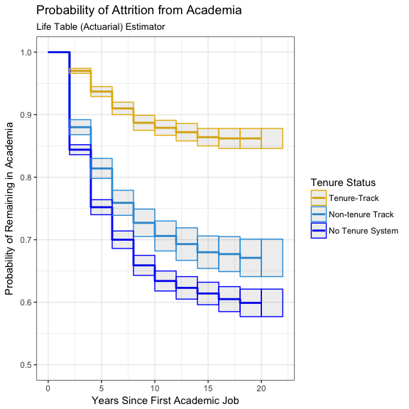
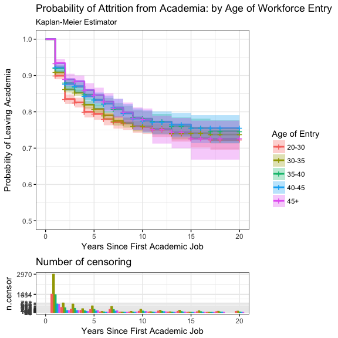

Faculty Attrition
================
Chad Evans

Built with R version 3.3.2.

Contents
--------

-   [Configure](#configure)
    -   directories
    -   libraries
    -   data
-   [Munge](#munge)
-   [Nonparametric Methods](#nonparametric-methods)
    -   [Life Table Method](#life-table-method)
    -   [Kaplan Meier Estimator](#kaplan-meier-estimator)
        -   Measures of central tendency
        -   Multiple group testing
    -   Nelson Aalen Estimator
-   [Semiparametric Methods](#semiparametric-methods)
    -   Cox Proportional Hazards Model
        -   [Cox Model Specification](#cox-model-specification)
        -   Testing the assumption of proportional hazards
-   [Parametric Methods](#parametric-methods)
    -   Accelerated Failure Time Models
        -   Exponential
        -   Lognormal
        -   [AFT Specification](#aft-specification)
-   [Comparing the Cox model and the Exponential AFT model](#comparing-the-cox-model-and-the-exponential-aft-model)
-   [Extensions](#extensions)
    -   Ridge Regression
    -   Smoothing Splines
    -   Frailty Models

Configure
---------

``` r
library(knitr)
library(tidyverse)
library(corrplot)
library(Hmisc)
library(plyr)
library(dplyr)
library(survival)
library(KMsurv)
library(car)
library(RColorBrewer)
library(survminer)
```

Munge
-----

``` r
data<-sdata %>%
  filter(!(EntryTENSTA=="Tenured")) %>% # Remove those few who start off with tenure
  droplevels() %>%
  mutate(TIME=as.numeric(EndDate)-as.numeric(EntryDate))
  
data$TIME[data$TIME==0]<-1 # necessary to correct for zero time case (given value of 1)
data<-na.omit(data)
```

``` r
length(unique(data$REFID)) # The number of individuals who participated in the study
```

    ## [1] 19349

### Assumptions of Survival Analysis

1.  Non-informative censoring: The study must ensure that the mechanisms resulting in censoring are not related to the probability of an event occurring. Conditional on the explanatory variables, censored at a certain time cannot give any information about an individuals hazard at that time. Going missing from the study or never leaving academia (never attriting) cannot be related to the conditional probability of an event occuring.

2.  Proportional hazards: for Cox PH models, survival curves related to different strata must have hazard functions that are proportional over time (i.e. constant relative hazard).

Nonparametric Methods
---------------------

### Life Table Method

This is also known as the actuarial method.

``` r
intervals<-2 # number of intervals for life table
ltab.data<-data %>% 
  mutate(interval = floor(TIME/intervals)) %>%
  select(interval,Censor) %>%
  group_by(interval) %>%
  dplyr::summarise(attrit=sum(Censor), count=n()) %>%
  mutate(nlost=count-attrit)
```

``` r
int<-c(ltab.data$interval,NA) #length is 1 + nlost and nevent 
lifetable<-round(with(ltab.data, lifetab(tis=int, ninit=nrow(data), nlost=nlost, nevent=attrit)),3)
kable(lifetable)
```

|       |  nsubs|  nlost|    nrisk|  nevent|   surv|    pdf|  hazard|  se.surv|  se.pdf|  se.hazard|
|-------|------:|------:|--------:|-------:|------:|------:|-------:|--------:|-------:|----------:|
| 0-1   |  19349|   7045|  15826.5|    1692|  1.000|  0.107|   0.113|    0.000|   0.002|      0.003|
| 1-2   |  10612|   3278|   8973.0|     655|  0.893|  0.065|   0.076|    0.002|   0.002|      0.003|
| 2-3   |   6679|   1954|   5702.0|     295|  0.828|  0.043|   0.053|    0.003|   0.002|      0.003|
| 3-4   |   4430|   1334|   3763.0|     150|  0.785|  0.031|   0.041|    0.004|   0.003|      0.003|
| 4-5   |   2946|    283|   2804.5|      66|  0.754|  0.018|   0.024|    0.005|   0.002|      0.003|
| 5-6   |   2597|    725|   2234.5|      30|  0.736|  0.010|   0.014|    0.005|   0.002|      0.002|
| 6-7   |   1842|    589|   1547.5|      20|  0.726|  0.009|   0.013|    0.005|   0.002|      0.003|
| 7-8   |   1233|    443|   1011.5|       7|  0.717|  0.005|   0.007|    0.006|   0.002|      0.003|
| 8-9   |    783|    307|    629.5|       3|  0.712|  0.003|   0.005|    0.006|   0.002|      0.003|
| 9-10  |    473|    230|    358.0|       0|  0.708|  0.000|   0.000|    0.006|     NaN|        NaN|
| 10-NA |    243|    243|    121.5|       0|  0.708|     NA|      NA|    0.006|      NA|         NA|

Variance estimated using Greenwood's formula.

``` r
plot(intervals*int[-11], lifetable[,5], type="s", xlab="Years Since First Academic Job", ylab="Proportion Remaining in Academia", main="Life Table Survival Curve")
```



### Kaplan Meier Estimator

Also known as the product limit estimator of the survial curve, there is one major difference with the Life Table method: if observations are censored on the same month (or time unit) that events occurred, they are assumed to be at risk for the whole month (rather than just half the month). This method is most appropriate for small data sets with exact times of censoring and events. The KM estimator is a limiting form of the actuarial method, such that the time intervals are only as large as the units of measurement.

``` r
sdr.surv <- survfit( Surv(TIME, Censor)~ 1, data=data, conf.type="log", type="kaplan-meier")
ggsurvplot(sdr.surv, data = data, ylim = c(.5,1), size = 1, palette = c("blue") ,conf.int = TRUE, ggtheme = theme_bw(), title="Probability of Attrition from Academia", subtitle="Kaplan-Meier Estimator", xlab="Years Since First Academic Job", ylab="Probability of Leaving Academia", legend="none")
```


We can plot this figure with confidence intervals as well. The default (above) is log, which calculates intervals based on the cumulative hazard or log(survival). Other options include plain or log-log. IDRE has code for another method called loghall.

#### Measures of Central Tendencies

Its useful to summarize distributions based on average time until attrition, as well as quantile calculations.

    ## [1] "Assuming a lifecourse of 20 years, the average career is 15.9 years."

    ## [1] "Assumming a lifecourse of 35 years, the average career is 26.9 years."

    ## [1] "25 Percent of the sample lasts 13 or fewer years"

    ## [1] "10 Percent of the sample lasts 2 or fewer years"

This mean is based on a truncated estimator, so we need to set an upper limit. If we only look at the twenty years in the study, the mean survival time is 15.9 years. If were were to assume a traditional career is 35 years, the average career time in academia would be 26.9 years. Because the majority of study participants do not attrit within the confines of this study, it is impossible to calculate a median survival time. Instead, we can say that 25 percent of the sample lasts 13 years or less. 10 percent of the sample lasts 2 years or fewer. That is a lot of attrition.

#### Multiple Group Testing

##### Comparing Different Tenure Status

``` r
km.tenure <- survfit( Surv(TIME, Censor)~ strata(EntryTENSTA), data=data, type="kaplan-meier")
ggsurvplot(km.tenure, data = data, ylim = c(.5,1), size = 1, palette = c("#E7B800", "#2E9FDF", "blue"),
  conf.int = TRUE, legend.labs = 
    c("Tenure-Track", "Non-Tenure track","No Tenure System"),  ggtheme = theme_bw(),  ncensor.plot.height = 0.25, title="Probability of Remaining in Academia: by Initial Tenure Status", subtitle="Kaplan-Meier Estimator", xlab="Years Since First Academic Job", ylab="Probability of Remaining in Academia", legend="right", legend.title="Tenure Status",ncensor.plot =F )
```


##### Statistical Test for differences

The following function implements the G-rho family of Harrington and Fleming (1982), with weights on each death of S(t)^rho, where S is the Kaplan-Meier estimate of survival. With rho = 0 this is the log-rank or Mantel-Haenszel test, and with rho = 1 it is equivalent to the Peto & Peto modification of the Gehan-Wilcoxon test. Allison also discusses other possibilities, including the Wilcoxon test, the Cox test of equality, the Tarone-Ware test of equality, the Peto-Peto-Prentice test of equality and the Generalized Fleming-Harrington test of equality. Let's look at the most common test, the log-rank test.

``` r
survdiff(Surv(TIME, Censor) ~ EntryTENSTA, data=data,rho=0) # log-rank or Mantel-Haenszel test
```

    ## Call:
    ## survdiff(formula = Surv(TIME, Censor) ~ EntryTENSTA, data = data, 
    ##     rho = 0)
    ## 
    ##                                           N Observed Expected (O-E)^2/E
    ## EntryTENSTA=Tenure-Track               6323      424     1067    387.67
    ## EntryTENSTA=NTT                        3576      591      528      7.46
    ## EntryTENSTA=Non-tenure System/Position 9450     1903     1323    254.74
    ##                                        (O-E)^2/V
    ## EntryTENSTA=Tenure-Track                  659.75
    ## EntryTENSTA=NTT                             9.76
    ## EntryTENSTA=Non-tenure System/Position    503.17
    ## 
    ##  Chisq= 702  on 2 degrees of freedom, p= 0

The null hypothesis for a log-rank test is that the groups have the same survival. In this case, the Chi-square statistic is significant for both age and tenure status of first appointment. The survival curve, therefore, differs based on the entry age (or tenure status) of the PhD recipient's first academic job). But the KM approach is not able to estimate survival adjusted for covariates. For this reason, we will return to the semi-parametric Cox Proportional hazards model and also parametric survival models shortly.

Now let's look at the typical surival times between these groups.

##### Central tendencies

``` r
km.means.quantiles(km.tenure, 20)
```

    ## [1] "When assuming career span equals 20, the average career duration in years is..."
    ##               strata(EntryTENSTA)=Tenure-Track 
    ##                                         18.112 
    ##                        strata(EntryTENSTA)=NTT 
    ##                                         15.367 
    ## strata(EntryTENSTA)=Non-tenure System/Position 
    ##                                         14.332 
    ## [1] "25 Percent of the sample (or this category) lasts NA or fewer years"
    ## [2] "25 Percent of the sample (or this category) lasts 9 or fewer years" 
    ## [3] "25 Percent of the sample (or this category) lasts 5 or fewer years" 
    ## [1] "10 Percent of the sample (or this category) lasts 8 or fewer years"
    ## [2] "10 Percent of the sample (or this category) lasts 2 or fewer years"
    ## [3] "10 Percent of the sample (or this category) lasts 1 or fewer years"

``` r
km.means.quantiles(km.tenure, 35)
```

    ## [1] "When assuming career span equals 35, the average career duration in years is..."
    ##               strata(EntryTENSTA)=Tenure-Track 
    ##                                         31.232 
    ##                        strata(EntryTENSTA)=NTT 
    ##                                         25.867 
    ## strata(EntryTENSTA)=Non-tenure System/Position 
    ##                                         23.915 
    ## [1] "25 Percent of the sample (or this category) lasts NA or fewer years"
    ## [2] "25 Percent of the sample (or this category) lasts 9 or fewer years" 
    ## [3] "25 Percent of the sample (or this category) lasts 5 or fewer years" 
    ## [1] "10 Percent of the sample (or this category) lasts 8 or fewer years"
    ## [2] "10 Percent of the sample (or this category) lasts 2 or fewer years"
    ## [3] "10 Percent of the sample (or this category) lasts 1 or fewer years"

Those on the tenure-track tend to have lengthy careers (31.2 years, assuming 35 year-long career). NTT and those outside of tenure systems typically remain in academia between 24 and 26 years. 10 percent of tenure track faculty remain 8 years or fewer. This same proportion lasts two years or fewer in the case of NTT faculty and 1 year or fewer in the case of non-tenure-system faculty.

This method can also be used to look at the survival curves of other groups in the data.

``` r
data$agecat <- cut(data$EntryAGE, c(20,30,35,40,45,70))
km.age <- survfit(Surv(TIME, Censor) ~ strata(data$agecat), data=data,conf.type="log-log")
ggsurvplot(km.age, data = data, ylim = c(.5,1), size = 1,
  conf.int = TRUE, legend.labs = c("20-30", "30-35", "35-40", "40-45", "45+"),  ggtheme = theme_bw(), title="Probability of Attrition from Academia: by Age of Workforce Entry", subtitle="Kaplan-Meier Estimator", xlab="Years Since First Academic Job", ylab="Probability of Leaving Academia", ncensor.plot = TRUE,  ncensor.plot.height = 0.25, legend="right", legend.title="Age of Entry")
```



#### Summary of Nonparametric models

Kaplan-Meier curves and log-rank tests are most useful when the predictor variable is categorical (e.g., drug vs. placebo), or takes a small number of values (e.g., drug doses 0, 20, 50, and 100 mg/day) that can be treated as categorical. The log-rank test and KM curves don’t work easily with quantitative predictors. For quantitative predictor variables, we turn to alternative methods like the Cox proportional hazards model or Accelerated Failure Time (AFT) models. Such models work also with categorical predictor variables, encoded as {0,1} indicator or dummy variables.

Regression Models for Survival Data
-----------------------------------

There are two types of regression models:

1.  Semi-parametric models, the most common of which is the Cox Proportional Hazards model. Proportional hazard models in general (like the Cox model) assume that the effect of a covariate is to multiply a baseline hazard by some constant. Hazards are “proportional” when the ratio of the hazards for any two individuals is constant, i.e., it does not depend on time.

2.  Fully Parametric AFT models, where it is assumed that log(To) has a specific probability distribution. This class of models assumes that the effect of a covariate is to accelerate or decelerate the life course of a career by some constant.

One case worth noting is that the Weibull distribution (including the exponential distribution as a special case) can be parameterised as either a proportional hazards model or an AFT model. It is the only family of distributions that possesses this property.

### Semiparametric Methods

The most common semiparametric method is the Cox Proportional Hazards Model. The biggest advantage of the Cox model relates to its flexibilty of functional form. Parametric models require a choice of functional form and often there is no good basis for which to choose. In many instances the choice can be overly restrictive. The Cox model requires no commitment to the functional form of the baseline hazard function. This is a semi-parametric model in that only the effects of covariates are parametrized, and not the hazard function. In other words, we don't make any distributional assumptions about survival times.

First, we fit a simple Cox model predicting attrition from academia from a categorical predictor of tenure status at workforce entry. We employ the efron method of dealing with ties, although other popular methods (e.g., breslow method) are available. The Efron approximation is more accurate when dealing with tied death times, and is as efficient computationally.

``` r
coxph_mod1 <- coxph( Surv(TIME,Censor)~EntryTENSTA, data=data, method="efron") # breslow option available
summary(coxph_mod1)
```

    ## Call:
    ## coxph(formula = Surv(TIME, Censor) ~ EntryTENSTA, data = data, 
    ##     method = "efron")
    ## 
    ##   n= 19349, number of events= 2918 
    ## 
    ##                                          coef exp(coef) se(coef)     z
    ## EntryTENSTANTT                        1.06636   2.90478  0.06370 16.74
    ## EntryTENSTANon-tenure System/Position 1.33451   3.79814  0.05386 24.78
    ##                                       Pr(>|z|)    
    ## EntryTENSTANTT                          <2e-16 ***
    ## EntryTENSTANon-tenure System/Position   <2e-16 ***
    ## ---
    ## Signif. codes:  0 '***' 0.001 '**' 0.01 '*' 0.05 '.' 0.1 ' ' 1
    ## 
    ##                                       exp(coef) exp(-coef) lower .95
    ## EntryTENSTANTT                            2.905     0.3443     2.564
    ## EntryTENSTANon-tenure System/Position     3.798     0.2633     3.418
    ##                                       upper .95
    ## EntryTENSTANTT                            3.291
    ## EntryTENSTANon-tenure System/Position     4.221
    ## 
    ## Concordance= 0.638  (se = 0.006 )
    ## Rsquare= 0.04   (max possible= 0.941 )
    ## Likelihood ratio test= 788.5  on 2 df,   p=0
    ## Wald test            = 614.2  on 2 df,   p=0
    ## Score (logrank) test = 699.3  on 2 df,   p=0

Proportional Hazards models and AFT models must be interpreted in different ways. AFT models give the percentage change in survival time. Cox PH models give the percentage change to the hazard at all time points, following this formula: *h*(*t*)=*h*<sub>0</sub>(*t*)*e*<sup>(*β*′*x*)</sup>

In this case, the effect of initial tenure status on time to attrition has an estimated coefficient of 1.0663584 and 1.3345106. Exponentiated, this means that subjects appointed to lower tenure-status jobs multiply their baseline hazards *h*<sub>0</sub>(*t*) by a factor of 2.9047821 and 3.7981366. Their "risk"" of attriting from academia is 190.4782143 and 279.8136602 percent higher than academics who begin immediately on the tenure-track. Importantly, Cox models state that this is the impact on the subject's hazard at any given time, t. It does not, however, imply an expansion (or contraction) of the lifespan of the subject.

Now let's build a more comprehensive model.

``` r
#We also have "CARNEG" available, but its correlation with EMTP makes it tough to interpret
coxph_mod2 <- coxph( Surv(TIME,Censor)~EntryTENSTA+EntryWAPRI+EntryGOVSUP+EntryWKTRNI+EntryPUBPRI+EntryEMTP+SDRCARN+EntryAGE+GENDER+MINRTY+EntryMARIND+EntryCHLVIN+EntryCTZUSIN, data=data ,method="efron", robust = TRUE) # breslow option available
summary(coxph_mod2)
```

    ## Call:
    ## coxph(formula = Surv(TIME, Censor) ~ EntryTENSTA + EntryWAPRI + 
    ##     EntryGOVSUP + EntryWKTRNI + EntryPUBPRI + EntryEMTP + SDRCARN + 
    ##     EntryAGE + GENDER + MINRTY + EntryMARIND + EntryCHLVIN + 
    ##     EntryCTZUSIN, data = data, robust = TRUE, method = "efron")
    ## 
    ##   n= 19349, number of events= 2918 
    ## 
    ##                                            coef exp(coef)  se(coef)
    ## EntryTENSTANTT                         0.931669  2.538742  0.066219
    ## EntryTENSTANon-tenure System/Position  1.078057  2.938965  0.060336
    ## EntryWAPRIResearch                    -0.114184  0.892094  0.050635
    ## EntryWAPRITeaching                    -0.508433  0.601438  0.066259
    ## EntryGOVSUPSupport                    -0.032798  0.967734  0.042841
    ## EntryWKTRNITraining                    0.055696  1.057277  0.037905
    ## EntryPUBPRIPrivate                     0.014876  1.014987  0.038755
    ## EntryEMTPFour-year                     0.307654  1.360230  0.157883
    ## EntryEMTPMed                           0.454255  1.575000  0.162729
    ## EntryEMTPUni Research Institute        0.466352  1.594168  0.163972
    ## EntryEMTPOther Ed                      1.585425  4.881364  0.278364
    ## SDRCARNR2                              0.055661  1.057239  0.063059
    ## SDRCARNDoctorate                       0.066018  1.068246  0.062606
    ## SDRCARNOther                           0.252599  1.287366  0.129665
    ## SDRCARNMedHealth                       0.015286  1.015404  0.090038
    ## EntryAGE                              -0.007072  0.992953  0.003199
    ## GENDERMale                             0.097610  1.102533  0.038044
    ## MINRTYYes                             -0.078784  0.924240  0.050527
    ## EntryMARINDYes                        -0.078078  0.924892  0.044193
    ## EntryCHLVINYes                        -0.026455  0.973892  0.045044
    ## EntryCTZUSINCitizen                    0.043538  1.044500  0.044188
    ##                                       robust se      z Pr(>|z|)    
    ## EntryTENSTANTT                         0.064755 14.388  < 2e-16 ***
    ## EntryTENSTANon-tenure System/Position  0.058227 18.515  < 2e-16 ***
    ## EntryWAPRIResearch                     0.050306 -2.270  0.02322 *  
    ## EntryWAPRITeaching                     0.065029 -7.819 5.33e-15 ***
    ## EntryGOVSUPSupport                     0.043020 -0.762  0.44582    
    ## EntryWKTRNITraining                    0.037834  1.472  0.14099    
    ## EntryPUBPRIPrivate                     0.038650  0.385  0.70032    
    ## EntryEMTPFour-year                     0.154489  1.991  0.04643 *  
    ## EntryEMTPMed                           0.159619  2.846  0.00443 ** 
    ## EntryEMTPUni Research Institute        0.160879  2.899  0.00375 ** 
    ## EntryEMTPOther Ed                      0.256357  6.184 6.23e-10 ***
    ## SDRCARNR2                              0.062882  0.885  0.37607    
    ## SDRCARNDoctorate                       0.062499  1.056  0.29083    
    ## SDRCARNOther                           0.131518  1.921  0.05478 .  
    ## SDRCARNMedHealth                       0.088041  0.174  0.86216    
    ## EntryAGE                               0.003204 -2.207  0.02729 *  
    ## GENDERMale                             0.037774  2.584  0.00976 ** 
    ## MINRTYYes                              0.050717 -1.553  0.12033    
    ## EntryMARINDYes                         0.044305 -1.762  0.07802 .  
    ## EntryCHLVINYes                         0.045348 -0.583  0.55963    
    ## EntryCTZUSINCitizen                    0.043767  0.995  0.31984    
    ## ---
    ## Signif. codes:  0 '***' 0.001 '**' 0.01 '*' 0.05 '.' 0.1 ' ' 1
    ## 
    ##                                       exp(coef) exp(-coef) lower .95
    ## EntryTENSTANTT                           2.5387     0.3939    2.2361
    ## EntryTENSTANon-tenure System/Position    2.9390     0.3403    2.6220
    ## EntryWAPRIResearch                       0.8921     1.1210    0.8083
    ## EntryWAPRITeaching                       0.6014     1.6627    0.5295
    ## EntryGOVSUPSupport                       0.9677     1.0333    0.8895
    ## EntryWKTRNITraining                      1.0573     0.9458    0.9817
    ## EntryPUBPRIPrivate                       1.0150     0.9852    0.9409
    ## EntryEMTPFour-year                       1.3602     0.7352    1.0049
    ## EntryEMTPMed                             1.5750     0.6349    1.1519
    ## EntryEMTPUni Research Institute          1.5942     0.6273    1.1630
    ## EntryEMTPOther Ed                        4.8814     0.2049    2.9534
    ## SDRCARNR2                                1.0572     0.9459    0.9346
    ## SDRCARNDoctorate                         1.0682     0.9361    0.9451
    ## SDRCARNOther                             1.2874     0.7768    0.9948
    ## SDRCARNMedHealth                         1.0154     0.9848    0.8545
    ## EntryAGE                                 0.9930     1.0071    0.9867
    ## GENDERMale                               1.1025     0.9070    1.0239
    ## MINRTYYes                                0.9242     1.0820    0.8368
    ## EntryMARINDYes                           0.9249     1.0812    0.8480
    ## EntryCHLVINYes                           0.9739     1.0268    0.8911
    ## EntryCTZUSINCitizen                      1.0445     0.9574    0.9586
    ##                                       upper .95
    ## EntryTENSTANTT                           2.8823
    ## EntryTENSTANon-tenure System/Position    3.2943
    ## EntryWAPRIResearch                       0.9845
    ## EntryWAPRITeaching                       0.6832
    ## EntryGOVSUPSupport                       1.0529
    ## EntryWKTRNITraining                      1.1387
    ## EntryPUBPRIPrivate                       1.0949
    ## EntryEMTPFour-year                       1.8413
    ## EntryEMTPMed                             2.1535
    ## EntryEMTPUni Research Institute          2.1851
    ## EntryEMTPOther Ed                        8.0678
    ## SDRCARNR2                                1.1959
    ## SDRCARNDoctorate                         1.2075
    ## SDRCARNOther                             1.6659
    ## SDRCARNMedHealth                         1.2066
    ## EntryAGE                                 0.9992
    ## GENDERMale                               1.1873
    ## MINRTYYes                                1.0208
    ## EntryMARINDYes                           1.0088
    ## EntryCHLVINYes                           1.0644
    ## EntryCTZUSINCitizen                      1.1381
    ## 
    ## Concordance= 0.667  (se = 0.006 )
    ## Rsquare= 0.048   (max possible= 0.941 )
    ## Likelihood ratio test= 960.5  on 21 df,   p=0
    ## Wald test            = 794.5  on 21 df,   p=0
    ## Score (logrank) test = 881.2  on 21 df,   p=0,   Robust = 947.8  p=0
    ## 
    ##   (Note: the likelihood ratio and score tests assume independence of
    ##      observations within a cluster, the Wald and robust score tests do not).

### Cox Model Specification

``` r
table<-round(as.data.frame(summary(coxph_mod2)$coefficients),3)
rownames(table)<-c("Non-tenure Track","No Tenure System","Researcher","Teacher","Gov't Support","Workplace Training","Private Control","Four-year","Medical","Research Institute","Other Educ","PhD Research II", "PhD Doctorate Institution","PhD Other", "PhD Medical/Health","Age","Male","Minority","Married","Parent","Citizen")
cox_table<-table
kable(cox_table)
```

|                           |    coef|  exp(coef)|  se(coef)|  robust se|       z|  Pr(&gt;|z|)|
|---------------------------|-------:|----------:|---------:|----------:|-------:|------------:|
| Non-tenure Track          |   0.932|      2.539|     0.066|      0.065|  14.388|        0.000|
| No Tenure System          |   1.078|      2.939|     0.060|      0.058|  18.515|        0.000|
| Researcher                |  -0.114|      0.892|     0.051|      0.050|  -2.270|        0.023|
| Teacher                   |  -0.508|      0.601|     0.066|      0.065|  -7.819|        0.000|
| Gov't Support             |  -0.033|      0.968|     0.043|      0.043|  -0.762|        0.446|
| Workplace Training        |   0.056|      1.057|     0.038|      0.038|   1.472|        0.141|
| Private Control           |   0.015|      1.015|     0.039|      0.039|   0.385|        0.700|
| Four-year                 |   0.308|      1.360|     0.158|      0.154|   1.991|        0.046|
| Medical                   |   0.454|      1.575|     0.163|      0.160|   2.846|        0.004|
| Research Institute        |   0.466|      1.594|     0.164|      0.161|   2.899|        0.004|
| Other Educ                |   1.585|      4.881|     0.278|      0.256|   6.184|        0.000|
| PhD Research II           |   0.056|      1.057|     0.063|      0.063|   0.885|        0.376|
| PhD Doctorate Institution |   0.066|      1.068|     0.063|      0.062|   1.056|        0.291|
| PhD Other                 |   0.253|      1.287|     0.130|      0.132|   1.921|        0.055|
| PhD Medical/Health        |   0.015|      1.015|     0.090|      0.088|   0.174|        0.862|
| Age                       |  -0.007|      0.993|     0.003|      0.003|  -2.207|        0.027|
| Male                      |   0.098|      1.103|     0.038|      0.038|   2.584|        0.010|
| Minority                  |  -0.079|      0.924|     0.051|      0.051|  -1.553|        0.120|
| Married                   |  -0.078|      0.925|     0.044|      0.044|  -1.762|        0.078|
| Parent                    |  -0.026|      0.974|     0.045|      0.045|  -0.583|        0.560|
| Citizen                   |   0.044|      1.045|     0.044|      0.044|   0.995|        0.320|

Even after controlling for background characteristics, there are significant differences. Here, NTT status or working at a college or university without a tenure system impacts the hazard, multiplying the baseline by a factor of 2.5387425 and 2.9389647. This is equivalent to saying that each tenure status increases the hazard of attrition by 153.8742476 and 193.8964672 percent, controlling for background characteristics. R output also provides the exponentiated negative coefficient. To my understanding, that just allows you to compare the groups relative to the baseline hazard of the tenure-track group. Robust standard errors were used in this model.

The model reveals several other important predcitors, including the subject main job, institution (employer) type, carnegie classification of graduate institution, age of first academic job, and gender.

An important assumption of the Cox model is that hazard functions are proportional. We can test each of the variables in the model, as well as test the model as a whole using the cox.zph() function. It tests proportionality by interacting each predictor with log time (km transformation). Rho is the pearson product-moment correlation between the scaled residuals (Schoenfeld) and log(time) for each covariate. The global test jointly tests all of the interactions. Low p-values suggest a violation of the assumption of proportional hazards.

``` r
cox.zph <- cox.zph(coxph_mod2, transform="km")
round(cox.zph$table,3)
```

    ##                                          rho   chisq     p
    ## EntryTENSTANTT                        -0.081  18.361 0.000
    ## EntryTENSTANon-tenure System/Position -0.098  25.583 0.000
    ## EntryWAPRIResearch                     0.005   0.063 0.801
    ## EntryWAPRITeaching                     0.034   3.206 0.073
    ## EntryGOVSUPSupport                    -0.033   3.312 0.069
    ## EntryWKTRNITraining                    0.026   1.951 0.163
    ## EntryPUBPRIPrivate                    -0.024   1.630 0.202
    ## EntryEMTPFour-year                    -0.018   0.907 0.341
    ## EntryEMTPMed                           0.014   0.592 0.442
    ## EntryEMTPUni Research Institute       -0.019   1.067 0.302
    ## EntryEMTPOther Ed                      0.020   1.025 0.311
    ## SDRCARNR2                              0.006   0.117 0.732
    ## SDRCARNDoctorate                       0.003   0.031 0.860
    ## SDRCARNOther                          -0.013   0.494 0.482
    ## SDRCARNMedHealth                       0.058   9.506 0.002
    ## EntryAGE                               0.050   7.670 0.006
    ## GENDERMale                            -0.036   3.809 0.051
    ## MINRTYYes                             -0.037   4.064 0.044
    ## EntryMARINDYes                        -0.032   3.083 0.079
    ## EntryCHLVINYes                        -0.021   1.313 0.252
    ## EntryCTZUSINCitizen                    0.006   0.092 0.762
    ## GLOBAL                                    NA 120.567 0.000

Generally, there is some evidence that the hazards are propoprtional. For most covariates, rho is not significant. However, it is concerning that it is significant for our two most important predictors above (NTT and Non-tenure system). also, the global test is significant. Check with Allison for weather he believe a Cox model is appropriate for this analysis.

#### Summary of Cox Proportional Hazard Models

If the proportional hazards assumption holds, then it is possible to estimate the effect of parameter(s) without any consideration of the baseline hazard function. As mentioned, this is in contrast to parametric models--the focus of our next section.

### Parametric Methods

Next, we fit a parametric survival regression model. These are location-scale models for an arbitrary transform of the time variable; the most common cases use a log transformation, leading to accelerated failure time (AFT) models. First, we assume the outcome has an exponential distribution--a good baseline distribution to start with (simplifies calculations). The exponential distribution implies a constant hazard rate. I also model with the log-logistic transformation. This is one of the more popular transformations because, unlike the Weibull distribution, it can exhibit a non-monotonic hazard function which increases at early times and decreases at later times. It also has a closed form solution that speeds up computation (important because of the consequences of censoring). The advantage of the Weibull (and by extention the exponential), of course, is that it can be parameterised as a PH model or an AFT model. In other words, the Weibull family can be interpreted as affecting the risk of event occurance or the duration of the lifespan. Other potential functions include log normal, gamma and inverse gaussian functions.

``` r
exp.mod <- survreg( Surv(TIME, Censor) ~ EntryTENSTA + EntryAGE, data=data, dist="exponential")
summary(exp.mod)
```

    ## 
    ## Call:
    ## survreg(formula = Surv(TIME, Censor) ~ EntryTENSTA + EntryAGE, 
    ##     data = data, dist = "exponential")
    ##                                          Value Std. Error      z         p
    ## (Intercept)                            3.98676    0.11567  34.47 2.47e-260
    ## EntryTENSTANTT                        -1.14667    0.06367 -18.01  1.65e-72
    ## EntryTENSTANon-tenure System/Position -1.49042    0.05373 -27.74 2.28e-169
    ## EntryAGE                               0.00905    0.00298   3.04  2.39e-03
    ## 
    ## Scale fixed at 1 
    ## 
    ## Exponential distribution
    ## Loglik(model)= -11961.6   Loglik(intercept only)= -12474.2
    ##  Chisq= 1025.31 on 3 degrees of freedom, p= 0 
    ## Number of Newton-Raphson Iterations: 6 
    ## n= 19349

For this first model, we parameterized log(t) using the exponential distribution. In the case of the exponential distribution, there is one extra parameter that allows *ϵ* to take on one of the extreme value distributions:

*f*(*ϵ*)=*e*<sup>(*ϵ* − *e*<sup>*ϵ*</sup>)</sup>

In the case of AFT models, covariates are interpreted as having a multiplicative effect on the survival time (the expected life span) of an individual. So, NTT status has a slope of -1.146665 in the simple model above. This means that beginning in a non-tenure track position causes time to attrition to change by -68.23055 percent. The expected time spent in academia before leaving, in other words, is lower for those starting in non-tenure track. Faculty beginning in no-tenure systems tend to spend even less time in academia -77.4720906 percent, compared to their tenure-track peers. In both cases, the life course is "accelerated."

We can also examine the coefficient for job-entry age. For a one unit increase in age, we expect a 0.9093729 percent change in survival time. Because the coefficient is so small, you can actually just multiply the coefficient by 100 to find an approximation of the percentage change. It "decelerates" the life course by about .9 percent, thereby increasing the total time span spent in academia.

Because the exponential distribution is a special case of the Weibull family, we can interpret the coefficients as changes in the hazard (as we did for cox models). While this is a good baseline, the log logistic transformation is more commonly used, thanks to its computational efficiently and (relative) flexibility of functional form. For the log-logistic parameterization, the errors are scaled as follows:

Now let's estimate a log logistic model. We'll use the same specification, but allow epsilon to take on a slightly different density:
*f*(*ϵ*)=*e*<sup>*ϵ*</sup>/(1 + *e*<sup>*ϵ*</sup>)<sup>2</sup>

``` r
ll.mod <- survreg( Surv(TIME, Censor) ~ EntryTENSTA+EntryAGE, data=data, dist="loglogistic")
summary(ll.mod)
```

    ## 
    ## Call:
    ## survreg(formula = Surv(TIME, Censor) ~ EntryTENSTA + EntryAGE, 
    ##     data = data, dist = "loglogistic")
    ##                                          Value Std. Error       z
    ## (Intercept)                            3.77441    0.13430  28.104
    ## EntryTENSTANTT                        -1.31429    0.07161 -18.352
    ## EntryTENSTANon-tenure System/Position -1.67977    0.05999 -28.001
    ## EntryAGE                               0.01273    0.00342   3.726
    ## Log(scale)                             0.00237    0.01436   0.165
    ##                                               p
    ## (Intercept)                           8.77e-174
    ## EntryTENSTANTT                         3.17e-75
    ## EntryTENSTANon-tenure System/Position 1.60e-172
    ## EntryAGE                               1.95e-04
    ## Log(scale)                             8.69e-01
    ## 
    ## Scale= 1 
    ## 
    ## Log logistic distribution
    ## Loglik(model)= -11750.6   Loglik(intercept only)= -12260.6
    ##  Chisq= 1020 on 3 degrees of freedom, p= 0 
    ## Number of Newton-Raphson Iterations: 5 
    ## n= 19349

In this case, the log logistic performs similarly to the exponential distribution, both in terms of fit and coefficient estimates. The simple curvature of the survival curves in this study makes both of these distributions similar. I'll opt for the exponential because it fits well, it is simpler and it can be interpreted in the same paradigm as before. We'll also fit the full model with robust standard errors.

#### Mathmatics

1.  Construct the likelihood function
    -   uncensored cases contribute their density probability at t
    -   censored cases contribute their survival probability at t

2.  Simplify the expression
3.  Take the log to simplify the math
4.  Calculate the derivative and set it equal to zero
5.  Solve using, typically, the Newton-Raphson algorithm

``` r
mod <- survreg( Surv(TIME, Censor) ~ EntryTENSTA+EntryWAPRI+EntryGOVSUP+EntryWKTRNI+EntryPUBPRI+EntryEMTP+SDRCARN+EntryAGE+GENDER+MINRTY+EntryMARIND+EntryCHLVIN+EntryCTZUSIN, data=data, dist="exponential", robust = TRUE)
summary(mod)
```

    ## 
    ## Call:
    ## survreg(formula = Surv(TIME, Censor) ~ EntryTENSTA + EntryWAPRI + 
    ##     EntryGOVSUP + EntryWKTRNI + EntryPUBPRI + EntryEMTP + SDRCARN + 
    ##     EntryAGE + GENDER + MINRTY + EntryMARIND + EntryCHLVIN + 
    ##     EntryCTZUSIN, data = data, dist = "exponential", robust = TRUE)
    ##                                          Value Std. Err (Naive SE)       z
    ## (Intercept)                            4.01552  0.22779    0.21707  17.628
    ## EntryTENSTANTT                        -0.98492  0.06888    0.06624 -14.299
    ## EntryTENSTANon-tenure System/Position -1.20161  0.06164    0.06030 -19.493
    ## EntryWAPRIResearch                     0.13115  0.05540    0.05068   2.367
    ## EntryWAPRITeaching                     0.56188  0.07012    0.06625   8.013
    ## EntryGOVSUPSupport                     0.06089  0.04713    0.04306   1.292
    ## EntryWKTRNITraining                   -0.06593  0.04135    0.03792  -1.595
    ## EntryPUBPRIPrivate                    -0.01985  0.04227    0.03877  -0.470
    ## EntryEMTPFour-year                    -0.34019  0.16233    0.15785  -2.096
    ## EntryEMTPMed                          -0.54708  0.16799    0.16253  -3.257
    ## EntryEMTPUni Research Institute       -0.53832  0.16949    0.16392  -3.176
    ## EntryEMTPOther Ed                     -1.79991  0.28176    0.27837  -6.388
    ## SDRCARNR2                             -0.06895  0.06856    0.06313  -1.006
    ## SDRCARNDoctorate                      -0.08851  0.06799    0.06258  -1.302
    ## SDRCARNOther                          -0.31089  0.14525    0.12992  -2.140
    ## SDRCARNMedHealth                      -0.04466  0.09718    0.09023  -0.460
    ## EntryAGE                               0.00511  0.00348    0.00322   1.469
    ## GENDERMale                            -0.06070  0.04122    0.03807  -1.473
    ## MINRTYYes                              0.06229  0.05462    0.05042   1.140
    ## EntryMARINDYes                         0.11912  0.04834    0.04421   2.464
    ## EntryCHLVINYes                         0.03464  0.04942    0.04518   0.701
    ## EntryCTZUSINCitizen                    0.09817  0.04741    0.04403   2.071
    ##                                              p
    ## (Intercept)                           1.49e-69
    ## EntryTENSTANTT                        2.23e-46
    ## EntryTENSTANon-tenure System/Position 1.26e-84
    ## EntryWAPRIResearch                    1.79e-02
    ## EntryWAPRITeaching                    1.12e-15
    ## EntryGOVSUPSupport                    1.96e-01
    ## EntryWKTRNITraining                   1.11e-01
    ## EntryPUBPRIPrivate                    6.39e-01
    ## EntryEMTPFour-year                    3.61e-02
    ## EntryEMTPMed                          1.13e-03
    ## EntryEMTPUni Research Institute       1.49e-03
    ## EntryEMTPOther Ed                     1.68e-10
    ## SDRCARNR2                             3.15e-01
    ## SDRCARNDoctorate                      1.93e-01
    ## SDRCARNOther                          3.23e-02
    ## SDRCARNMedHealth                      6.46e-01
    ## EntryAGE                              1.42e-01
    ## GENDERMale                            1.41e-01
    ## MINRTYYes                             2.54e-01
    ## EntryMARINDYes                        1.37e-02
    ## EntryCHLVINYes                        4.83e-01
    ## EntryCTZUSINCitizen                   3.84e-02
    ## 
    ## Scale fixed at 1 
    ## 
    ## Exponential distribution
    ## Loglik(model)= -11855.6   Loglik(intercept only)= -12474.2
    ##  Chisq= 1237.22 on 21 degrees of freedom, p= 0 
    ## (Loglikelihood assumes independent observations)
    ## Number of Newton-Raphson Iterations: 6 
    ## n= 19349

### AFT Specification

``` r
table<-as.data.frame(summary(mod)$table)
rownames(table)<-c("Intercept","Non-tenure Track","No Tenure System","Researcher","Teacher","Gov't Support","Workplace Training","Private Control","Four-year","Medical","Research Institute","Other Educ","PhD Research II", "PhD Doctorate Institution","PhD Other", "PhD Medical/Health","Age","Male","Minority","Married","Parent","Citizen")
table$expCoef<-exp(table$Value)
names(table)[names(table)=="Std. Err"]<-"Robust SE"
aft_table<-round(table[,c("Value","expCoef","Robust SE","z","p")],3)
kable(aft_table)
```

|                           |   Value|  expCoef|  Robust SE|        z|      p|
|---------------------------|-------:|--------:|----------:|--------:|------:|
| Intercept                 |   4.016|   55.452|      0.228|   17.628|  0.000|
| Non-tenure Track          |  -0.985|    0.373|      0.069|  -14.299|  0.000|
| No Tenure System          |  -1.202|    0.301|      0.062|  -19.493|  0.000|
| Researcher                |   0.131|    1.140|      0.055|    2.367|  0.018|
| Teacher                   |   0.562|    1.754|      0.070|    8.013|  0.000|
| Gov't Support             |   0.061|    1.063|      0.047|    1.292|  0.196|
| Workplace Training        |  -0.066|    0.936|      0.041|   -1.595|  0.111|
| Private Control           |  -0.020|    0.980|      0.042|   -0.470|  0.639|
| Four-year                 |  -0.340|    0.712|      0.162|   -2.096|  0.036|
| Medical                   |  -0.547|    0.579|      0.168|   -3.257|  0.001|
| Research Institute        |  -0.538|    0.584|      0.169|   -3.176|  0.001|
| Other Educ                |  -1.800|    0.165|      0.282|   -6.388|  0.000|
| PhD Research II           |  -0.069|    0.933|      0.069|   -1.006|  0.315|
| PhD Doctorate Institution |  -0.089|    0.915|      0.068|   -1.302|  0.193|
| PhD Other                 |  -0.311|    0.733|      0.145|   -2.140|  0.032|
| PhD Medical/Health        |  -0.045|    0.956|      0.097|   -0.460|  0.646|
| Age                       |   0.005|    1.005|      0.003|    1.469|  0.142|
| Male                      |  -0.061|    0.941|      0.041|   -1.473|  0.141|
| Minority                  |   0.062|    1.064|      0.055|    1.140|  0.254|
| Married                   |   0.119|    1.127|      0.048|    2.464|  0.014|
| Parent                    |   0.035|    1.035|      0.049|    0.701|  0.483|
| Citizen                   |   0.098|    1.103|      0.047|    2.071|  0.038|

The exponential distribution has a constant hazard *λ*(*t*)=*λ* and thus a survival function of *S*(*t*)=*e*<sup>−*λ*(*t*)</sup> and density of *f*(*t*)=*λ* × *e*<sup>−*λ*(*t*)</sup>. An interesting occurance is that the expected survival time for this distribution is *E*(*t*)=1/*λ* and its variance is *E*(*t*)=1/*λ*<sup>2</sup>. This makes the mean survival time equal to e^intercept (55.4522206). It's inverse (0.0180335) is the MLE of the (constant) hazard rate.

AFT models are typcally interpreted in a way that covariates have a multiplicative effect on the expected survival time. So, with regard to tenure status, taking your first job as NTT accelerates the time to attrition by a factor of 0.3734693 (0.3734693 times shorter survival time compared to the baseline survival). Beginning an academic career in a non-tenure system accelerates the time to attrition by a factor of 0.3007087. The life course for these states is -62.6530703 and -69.9291257 percent shorter, respectively.

The Weibull family of distributions (of which the exponential is a sub-class) has the advantage that covariates can also be interpreted as an impact on the hazard ratios. For this famiily of distributions, the coefficient is multiplied by -1 and then multiplied by a shape parameter (1/scale parameter). In the case of the exponential distributuion, the shape parameter is simply 1/1. So in our case, the hazard ratio comparing NTT to tenure-track positions is 2.6775963. The risk of attrition increases by a factor of 2.6775963 when one begins an academic career in a NTT position. Faculty with a first job at a non-teure system institution increases their risk by a factor of 3.325477.

Comparing the Cox model and the Exponential AFT model
-----------------------------------------------------

``` r
cox_table2<-rbind(rep(NA,6),cox_table)
ctable<-cbind(cox_table2[,c(2,6)],aft_table[,c(2,5)])
rownames(ctable)<-rownames(aft_table)
ctable$expCoef<-round(exp(aft_table$Value * -1 * 1/1),3) # convert to hazard ratios
colnames(ctable)<-c("Cox:HR","Cox p-val","AFT:HR","AFT p-val")
kable(ctable)
```

|                           |  Cox:HR|  Cox p-val|  AFT:HR|  AFT p-val|
|---------------------------|-------:|----------:|-------:|----------:|
| Intercept                 |      NA|         NA|   0.018|      0.000|
| Non-tenure Track          |   2.539|      0.000|   2.678|      0.000|
| No Tenure System          |   2.939|      0.000|   3.327|      0.000|
| Researcher                |   0.892|      0.023|   0.877|      0.018|
| Teacher                   |   0.601|      0.000|   0.570|      0.000|
| Gov't Support             |   0.968|      0.446|   0.941|      0.196|
| Workplace Training        |   1.057|      0.141|   1.068|      0.111|
| Private Control           |   1.015|      0.700|   1.020|      0.639|
| Four-year                 |   1.360|      0.046|   1.405|      0.036|
| Medical                   |   1.575|      0.004|   1.728|      0.001|
| Research Institute        |   1.594|      0.004|   1.713|      0.001|
| Other Educ                |   4.881|      0.000|   6.050|      0.000|
| PhD Research II           |   1.057|      0.376|   1.071|      0.315|
| PhD Doctorate Institution |   1.068|      0.291|   1.093|      0.193|
| PhD Other                 |   1.287|      0.055|   1.365|      0.032|
| PhD Medical/Health        |   1.015|      0.862|   1.046|      0.646|
| Age                       |   0.993|      0.027|   0.995|      0.142|
| Male                      |   1.103|      0.010|   1.063|      0.141|
| Minority                  |   0.924|      0.120|   0.940|      0.254|
| Married                   |   0.925|      0.078|   0.888|      0.014|
| Parent                    |   0.974|      0.560|   0.966|      0.483|
| Citizen                   |   1.045|      0.320|   0.907|      0.038|

Whether choosing to model as a Cox model or an exponential AFT model, the results are comparable. There are some minor differences in the hazard ratios associated with the demographic variables. But they are pretty minor.

Extensions
----------

Overfitting is always a risk when developing statistical models. There are several extensions for dealing with overfitting (Penalized Regression). Methods include ridge regression (ridge), smoothing splines (pspline), and frailty models (frailty).

### Ridge regression

We can also fit a model with different baseline survival shapes for each of the three tenure groups (i.e., two different scale parameters). Here, I also robustified the standard errors using the robust argument. I also included a ridge penalty on both predictors to prevent overfitting.

When employing ridge regression, the likelihood is penalised by theta/2 times the linear combination of the squared coefficients. When scaling, penalties are calculated based on rescaling covariates to have unit variance. for coefficients based on rescaling the predictors to have unit variance. If df is specified then theta is chosen based on an approximate degrees of freedom

``` r
rmod <- survreg( Surv(TIME, Censor) ~ EntryTENSTA+EntryWAPRI+EntryGOVSUP+EntryWKTRNI+EntryCARNEG+EntryPUBPRI+EntryEMTP+SDRCARN+EntryAGE+GENDER+MINRTY+EntryMARIND+EntryCHLVIN+EntryCTZUSIN + ridge(EntryTENSTA,EntryWAPRI,EntryGOVSUP,EntryWKTRNI,EntryCARNEG,EntryPUBPRI,EntryEMTP,SDRCARN,EntryAGE,GENDER,MINRTY,EntryMARIND,EntryCHLVIN,EntryCTZUSIN, theta=5, scale = T), data=data, dist="exponential")
summary(rmod)
```

``` r
rtable<-as.data.frame(summary(rmod)$table)
rownames(rtable)<-c("Intercept","Non-tenure Track","No Tenure System","Researcher","Teacher","Gov't Support","Workplace Training","Assoc/BA/MA Institution","Other Institution","Private Control","Four-year","Medical","Research Institute","Other Educ","Research II", "Doctorate Institution","Other", "Medical/Health","Age","Male","Minority","Married","Parent","Citizen",seq(1:14))
rtable$expCoef<-exp(rtable$Value)
names(rtable)[names(rtable)=="Std. Error"]<-"Ridge SE"
rtable<-round(rtable[1:24,],3)
rtable<-rtable[,c("Value","expCoef","Ridge SE","z","p")]
kable(rtable)
```

``` r
ctable<-cbind(table,rtable[1:24,])
kable(ctable)
```

### Frailty models

These models allow you to add a simple random effects term to a survival model (Cox or survreg).
